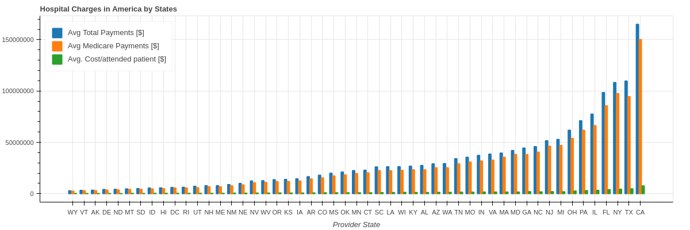

# Hospital Charges in America

This is a data-analysis exercise using Python with Bokeh in a Jupyter Notebook.

You can run entire notebook in [Colab](https://colab.research.google.com/drive/19I5HKDFvsKKVCRSY-l5jXGj7REDBAHSt#scrollTo=XqrUCHsKDGru) or in  [Binder](https://mybinder.org/v2/gh/isabelyb/hospital_charges_USA/HEAD).

## Undestanding the Business

### Medicare Overview

Medicare is a U.S. federal government health insurance program that subsidizes healthcare services. The plan covers people age 65 or older, younger people who meet specific eligibility criteria, and individuals with certain diseases.

### Data Source

This dataset contains the details of disease and the hospitals that treat them. It also has details about how much would it cost. Download from [Kaggle](https://www.kaggle.com/dhirajnirne/hospital-charges-in-america)

For more data related to Medicare : [Research Data Assistance Center](https://resdac.org/)

### Glossary

* **Average Covered Charges:** Hospital's average charge for services covered by Medicare for all discharges in the diagnosis related group.

* **Average Total Payments:** What Medicare actually pays to the provider as well as co-payment and deductible amounts that the beneficiary is responsible for and payments by third parties for coordination of benefits.

* **Average Medicare Payments:** The average amount that Medicare pays to the provider for Medicare's.

* **Diagnosis Related Group (DRG):** Patient classification system that standardizes prospective payment to hospitals.

* **Discharge** Is when the patient leaves the hospital and either returns home or is transferred to another facility.

* **Total Discharges:** The number of discharges billed by the provider for inpatient hospital services.

## Some questions about the the business

1. Which are the most expensive states and the cheapest ones?

To answer that question is necesary to clarify:

1.1. By **Avg Total Payments [$]**

💰 According to **Average Total Payments**  the three most expensive states are:

1. **California** with $164993988.  
2. **Texas** with $10967057.
3. **New York** with $108259026.

💰 According to **Average Total Payments**  the three most cheapest states are:

1. **West Virginia** with $2815426.
2. **Vermont** with $3176902.
3. **Arkansas** with $3366222.  

1.2. By **Discharges** (attended patient)

🤕 The three most expensive states are:
1. **Alaska** with $550.
2. **Hawaii** with $503.
3. **Wyoming** with $443.  

🤕 The three most cheapest states are:
1. **Delaware** with $215.
2. **Kentucky** with $226.
3. **Tennessee** with $227. 

1.3. By  **DRG** 

💉 The most expensive states by DRG are:
* **Alaska**: 42 DRG
* **Hawaii**: 21 DRG
* **Utah**: 13 DRG
* **Wyoming**: 8 DRG
* **West Virginia**: 7 DRG

💉 The most cheapest states by DRG are:
* **Delaware**: 20 DRG
* **Michigan**: 14 DRG
* **New Jersey**: 12 DRG
* **Maine**: 8 DRG
* **California**: 6 DRG

2. Cheapest Hospitals are in the same state?

3. Expensive hospitals share some special characteristic?

4. Wich is the DRG most expensive and the cheapest one?
5. Wich is the percentage received for hospitals according to their Average covered charges?
6. Amount received depends on the number of patients or the DRG?
7. How far are the expensive hospitals from the cheapest ones?